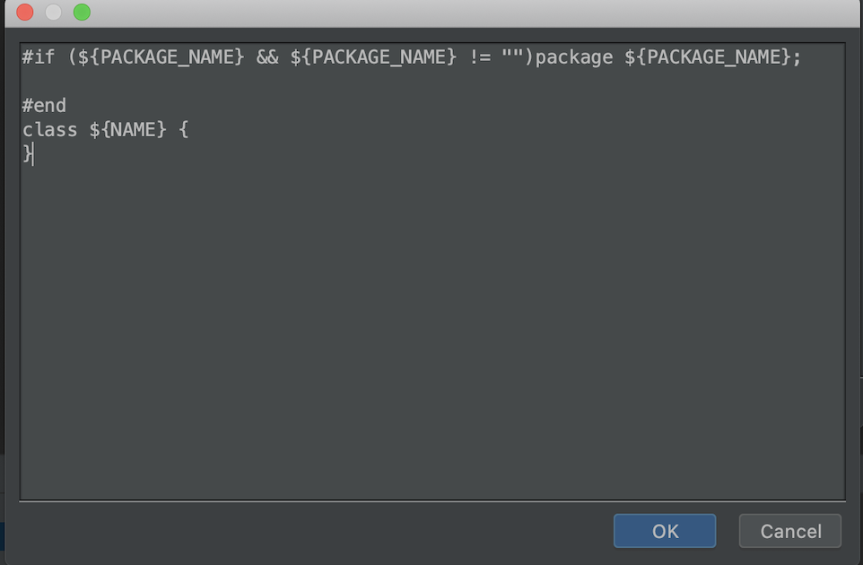
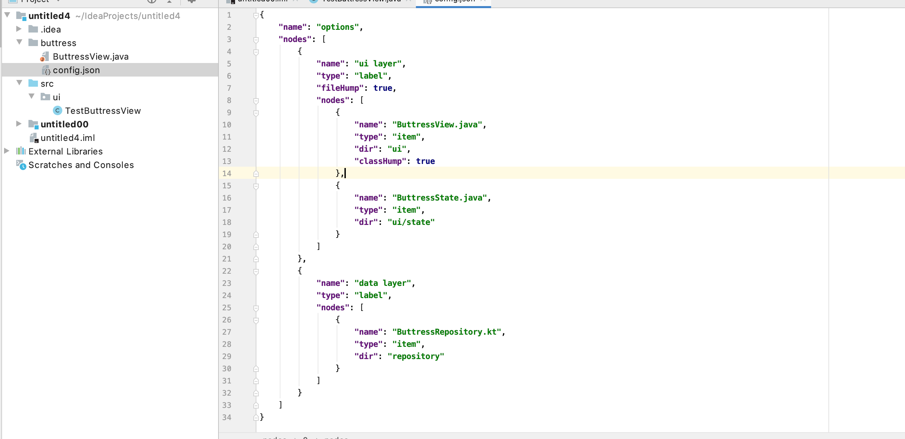
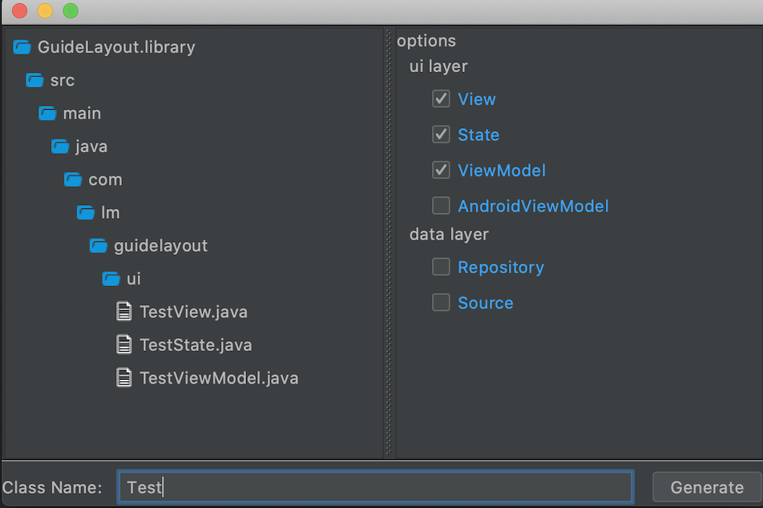

# AndroidArchitect
 A plugin for Android Studio to create clean android architecture

## Support Custom template of VTL(Velocity Template Language)

Custom template is available and compatible with VTL.



## Support custom options for clean architecture
Creating config.json file located in template directory of module modifies default options.



Default config.json:

```
{
    "language":"java",
    "options": [
        {
            "name": "ui layer",
            "type": "label",
            "nodes": [
                {
                    "name": "ui",
                    "type": "item",
                    "dir":"ui"
                },
                {
                    "name": "state",
                    "type": "item",
                    "dir":"state"
                }
            ]
        },
        {
            "name": "data layer",
            "type": "label",
            "nodes": [
                {
                    "name": "repository",
                    "type": "item"
                },
                {
                    "name": "source",
                    "type": "item"
                }
            ]
        }
    ]
}
```

Explanation for attributes:

| Attribute | Description                | Value               | Required |
|-----------|----------------------------|---------------------|----------|
| language  | suffix of created files    | [java &#124; kt]    | N        |
| options   | creating file options      | Option type         | Y        |
| name      | label or option name       | string type         | Y        |
| type      | label or option type       | [label &#124; item] | Y        |
| dir       | relative path to directory | string type         | N        |
| nodes     | children of last option    | Option Array        | N        |

## Preview file structure to be created
