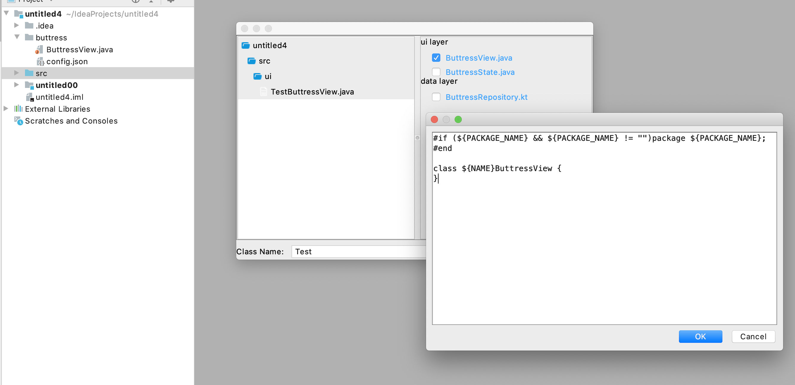

# AndroidArchitect
Provide one-click code template generation functionality for IntelliJ IDEs and Android Studio.

## Support parameters in code templates

| parameter    | Description          |
|--------------|----------------------|
| NAME         | prefix of class name |
| PACKAGE_NAME | package name         |

## Support configurations to specify code templates
Code templates and config.json are in buttress located in project or module root directory.

Explanation for attributes:

| Attribute | Description                | Value               | Required |
|-----------|----------------------------|---------------------|----------|
| name      | label or option name       | string type         | Y        |
| type      | label or option type       | [label &#124; item] | Y        |
| dir       | relative path to directory | string type         | N        |
| nodes     | children of option         | array  type         | N        |
| fileHump  | type of naming file        | [true &#124; false] | N        |
| classHump | type of class prefix       | string type         | N        |

## Preview file structure to be created
